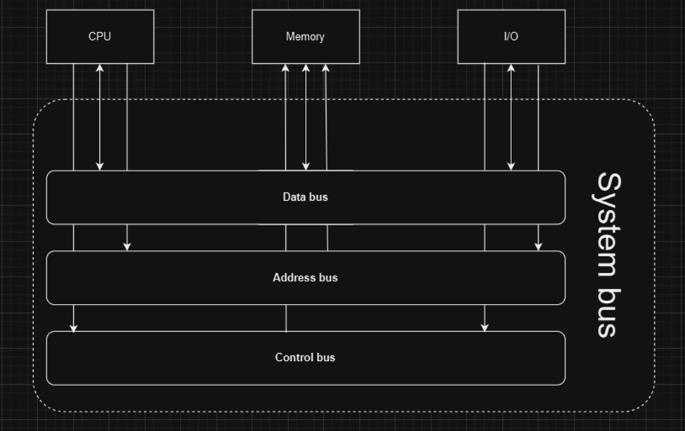

# Các công việc cần làm

## Các kiến thức cần chuẩn bị
- Kiến thức phần cứng máy tính
1. Nghiên cứu phần cứng máy tính
• Máy tính tiếp nhận dữ liệu đầu vào, lưu trữ, xử lý dữ liệu sau đó hiển thị/đầu ra.
• Thiết bị đầu vào: bàn phím, bàn di chuột, chuột, micrô, v.v.
• Thiết bị đầu ra: màn hình, loa, v.v.
• Vỏ máy tính bên ngoài: Mặt trước: Cổng USB, cổng tai nghe & micrô, ODD (để cắm CD). Mặt sau: Nguồn điện (cắm dây vào và nhấn nút ‘bắt đầu’ để bật máy tính), card chuyển đổi (các thành phần bổ sung chức năng mới cho máy tính. Ví dụ: mạng, đồ họa, âm thanh, lưu trữ, v.v.), các cổng khác (HDMI để kết nối máy tính với màn hình, giắc cắm âm thanh cho tai nghe & micrô & loa).
• Vỏ máy tính bên trong: quạt tản nhiệt (cho CPU), CPU (xử lý thông tin), RAM/thẻ nhớ (lưu trữ thông tin tạm thời), ổ cứng/ổ đĩa thể rắn (lưu trữ dữ liệu của người dùng), ROM (lưu trữ hướng dẫn khởi động và chỉ đọc), v.v.
• CPU: ALU (thực hiện các phép tính số học (+-x:) & logic (AND, OR, NOT)), bộ điều khiển (giải mã và kiểm soát việc phân phối hướng dẫn, cái nào thực hiện trước…sau), thanh ghi (tạm thời truy xuất dữ liệu cho ALU và CPU nói chung để truy cập nhanh), BUS (hoạt động như một đường dẫn để truyền dữ liệu trong/giữa các máy tính/dây + tín hiệu điều khiển)
• Thanh ghi: PC (Bộ đếm chương trình: đếm lên bất cứ khi nào một hướng dẫn được thực hiện bằng cách giữ địa chỉ của lệnh tiếp theo), IR (Thanh ghi lệnh giữ lệnh đang được thực thi), MAR (Thanh ghi địa chỉ bộ nhớ: lưu trữ địa chỉ (nơi lệnh đến, nơi lệnh sẽ đến) của lệnh cho đến khi lệnh được thực thi), SP (Con trỏ ngăn xếp: trỏ đến đầu ngăn xếp (hoạt động như một chồng giấy))
• Thêm về ngăn xếp: PUSH (thêm vào chồng giấy), POP (xóa khỏi ngăn xếp và bạn chỉ có thể xóa phần đầu tiên)  FILO (vào trước ra sau, phần tử đầu tiên trong ngăn xếp là phần tử cuối cùng rời khỏi và ngược lại).
• Bộ điều khiển: Có thể lập trình vi mô (Sử dụng các lệnh vi mô  Linh hoạt hơn vì mã có thể được cập nhật thuận tiện + lệnh tra cứu chậm), Có dây cứng (Mọi thứ đều được kết nối vật lý  Nhanh hơn vì lệnh có dây, không cần tra cứu + Ít linh hoạt hơn vì có nhiều dây hơn)
• Bộ nhớ: 8 bit = 1 byte; 1KB = 1024B  1MB=1024KB GB TB PB EBZBYB.
• Bộ nhớ (tiếp theo): Bộ nhớ đệm (nằm giữa CPU và RAM, lưu trữ dữ liệu thường xuyên truy cập từ RAM để CPU có thể hoạt động nhanh hơn), RAM (bộ nhớ chính, lưu trữ dữ liệu tạm thời để truy cập nhanh, có thể đọc và ghi dữ liệu, dễ bay hơi), D-RAM & S-RAM (bộ nhớ trước cần được làm mới trong khi bộ nhớ sau có thể duy trì trạng thái miễn là bật nguồn).
• Bộ nhớ (next2): ROM (không dễ bay hơi, lưu trữ bộ nhớ vĩnh viễn được sử dụng để hệ thống khởi động/hoạt động), PROM (có thể lập trình vì ban đầu nó trống), EPROM (có thể xóa bằng cách sử dụng tia UV trong thời gian dài), EEPROM (có thể xóa bằng cách sử dụng điện trong 4-10ms)
• Bộ nhớ chính: RAM, bộ nhớ đệm (không dễ bay hơi, có thể truy cập trực tiếp cho CPU, nhỏ)
• Bộ nhớ phụ: HDD, SSD (không dễ bay hơi, lớn, truy cập chậm hơn)
• Giao tiếp giữa các thành phần: sử dụng các dây truyền tải dữ liệu gọi là bus. Có 3 loại bus: data bus (gửi dữ liệu), address bus (chỉ định nơi gửi/địa chỉ bộ nhớ) và control bus (gửi tín hiệu điều khiển/lệnh, thời gian, ưu tiên).
• Khi CPU tương tác với bộ nhớ, dữ liệu (từ thiết bị đầu vào/từ ổ cứng) sử dụng bộ nhớ chính làm phương tiện để xử lý. Dữ liệu di chuyển qua lại (hai chiều) giữa hai bên.
• CPU ghi lại địa chỉ của bộ nhớ chính, một phần cụ thể nơi nó muốn đọc hoặc ghi dữ liệu vào address bus. Nó cũng gửi tín hiệu read hoặc write tùy thuộc vào các lệnh được thực thi qua control bus.
• Address bus và control bus là đơn chiều (chỉ có 1 chiều), trong khi data bus là hai chiều (có thể đọc dữ liệu từ bộ nhớ và ghi dữ liệu vào đó).
• CPU ghi dữ liệu bằng cách đưa dữ liệu vào data bus, dữ liệu này sau đó được ghi vào vị trí chỉ định bởi address bus. Ngược lại, nó đọc dữ liệu được truyền đến thông qua data bus từ vị trí đã chỉ định, với sự hỗ trợ của một thiết bị đặc biệt có chức năng quản lý luồng dữ liệu vào ra khỏi bộ nhớ, gọi là memory controller.
• Trong trường hợp có nhiều thiết bị cố gắng truy cập system bus (gọi chung cho 3 bus), mỗi thiết bị sẽ lần lượt sử dụng bus thông qua một cơ chế gọi là bus arbitration.
• Một số thành phần như I/O, thiết bị lưu trữ (HDD/SSD) hoặc thẻ (NIC, GPU, v.v.) không có quyền truy cập trực tiếp vào CPU giống như bộ nhớ và cần có các bộ điều khiển đóng vai trò là bộ dịch giữa chúng và CPU.

• Stack: Một cấu trúc dữ liệu lưu trữ các biến cục bộ và thông tin gọi hàm (địa chỉ trả về, tham số, tên, v.v.)
• SP (Stack Pointer): một thanh ghi chỉ vào đỉnh của stack, tức là mục mới nhất đã được thêm vào (hoạt động giống như một chồng giấy).
• Hành vi của stack: PUSH (thêm vào chồng giấy), POP (loại bỏ khỏi chồng và bạn chỉ có thể loại bỏ mục đầu tiên) → FILO (first in last out, mục đầu tiên vào stack sẽ là mục cuối cùng rời khỏi stack và ngược lại).
• Tuy nhiên, giống như một chồng giấy, bạn không thể xếp dữ liệu vô hạn, nếu không cả đống sẽ bị đổ (hiện tượng gọi là stack overflow) → stack có một kích thước cố định, điều này kết hợp với sự đơn giản của push/pop làm cho stack nhanh nhưng rất hạn chế.
• Heap giống như một đống đồ giặt không tổ chức. Không bị giới hạn bởi push/pop, có thể thêm hoặc xóa dữ liệu ở bất kỳ điểm nào.
• Nó phức tạp hơn trong việc xác định dữ liệu để sử dụng, tuy nhiên. Nếu bộ nhớ được cấp phát theo cách để lại những khoảng trống chưa sử dụng giữa các khối bộ nhớ, nó sẽ tạo ra một vấn đề gọi là memory fragmentation. Ví dụ: heap có 500MB. Sau đó bạn cấp phát (cắt nó thành các khối khác nhau): 100MB, 200MB, 50MB, 150MB và sử dụng tất cả chúng. Giả sử bạn giải phóng 150MB và 200MB và bạn cần vừa đủ 300MB dữ liệu để lưu trữ. Tuy nhiên, nó sẽ không vừa, vì bạn đã chia 350MB dữ liệu thành các khối 200MB và 150MB.
• Bộ nhớ cũng không được tự động làm sạch khi một hàm kết thúc, phải được làm thủ công. Nếu lập trình viên quên làm sạch bộ nhớ, sẽ dẫn đến memory leak, làm giảm hiệu suất.
• Sử dụng stack khi lưu trữ dữ liệu nhỏ, tạm thời, sử dụng heap khi lưu trữ dữ liệu lớn, động (dữ liệu mà bạn không biết kích thước của nó khi biên dịch).
- Kiến thức mạng máy tính
•	OSI model
•	TCP/UDP
•	VLAN, Subnet
•	Ethernet
•	Switches, Hubs
•	VLSM
•	Routing, Routing-on-a-stick (trunking, sub-interfaces)
•	Encapsulation
•	IPv4, IPv6
•	STP (spanning-tree)
•	Etherchannel
•	Wireshark
(to be updated)
### Tìm hiểu kiến thức về máy chủ web(Tomcat,IIS,Xampp)

### Tìm hiểu về kiến trúc một hệ thống phần mềm, cách thức các thành phần giao tiếp với nhau, vẽ sơ đồ

### Tìm hiểu công nghệ làm web
1. Frontend
2. Backend
3. Database
4. Cách thức các thành phần giao tiếp, trao đổi dữ liệu

### Tìm hiểu về các hệ thống quản lý mã nguồn(Github,Gitlab...)
1. Các lệnh git cơ bản
•	git init: initializes a hidden .git file (stores some info on branches, configurations, commit history, file data, etc.) 
•	git clone <URL>: copy to local device
•	git add . (all) vs git add <file_name> (specific files): adds the edited files to a plane called staging area.
•	git commit -m “whatever is fixed”: the “save” button
•	git remote add origin <URL to repo>: create a remote repo locally named ‘origin’.
•	git branch -m main: Renaming the branching you are working on to main, which is supposedly already done by default.
•	git pull origin main: pull/load it down to your local repo.
•	git push origin main: push/send it up to that remote repository. If there’s already data there: 	
•	If no changes were made since you last cloned, just push.
•	If new changes were made  your work is behind compared to the repo  git pull origin main  If there’s no overlapping changes, they will merge seamlessly.
•	If there is conflict, Git will ask you to look at your changes again.
•	git push –force origin main: to force a change regardless of conflicts.

2. Gitflow
•	Basic workflow: New changes are “added” (git add)  Staging area: in general, it is a place where an object (often mechanical) is put together before use. In Git, it’s where file changes are organized before being committed to a repo.   After finalizing changes, they are then saved to a repo (typically along with a comment overviewing the new adjustments). 